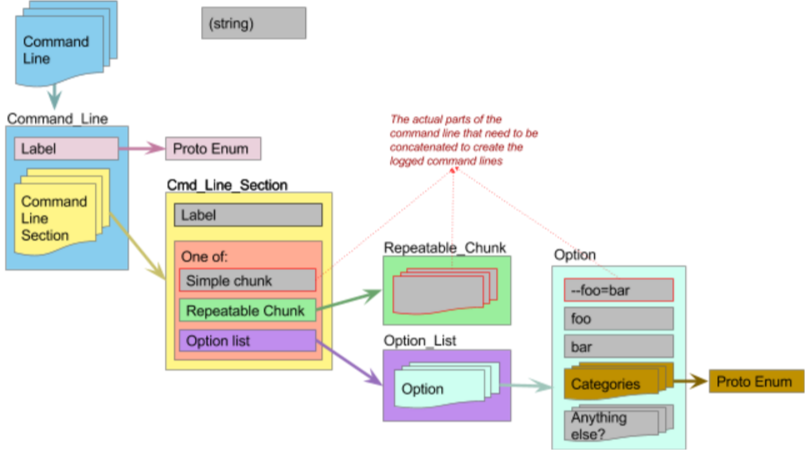

# Design Document: Improved command line reporting in Bazel

**Design documents are not descriptions of the current functionality of Bazel.
Always go to the documentation for current information.**

**Status**: In Progress.

**Author**: [Chloe Calvarin](mailto:ccalvarin@google.com)

**Design document published**: 13 July 2017

## Background

Currently, there is no good way for a Bazel user to get the command line that 
initiated a build, if they do not have access to the terminal history. The 
GotOptionsEvent tracks the various types of options (notably, startup and 
command options) and this information is starting to be used in Bazel by the 
BEP. However, this information is incomplete, and, unfortunately, not entirely 
correct.

The output information in the BEP is currently as follows:
```
message OptionsParsed {
  repeated string startup_options = 1;
  repeated string explicit_startup_options = 2;
  repeated string cmd_line = 3;
  repeated string explicit_cmd_line = 4;
  blaze.invocation_policy.InvocationPolicy invocation_policy = 5;
}
```

Startup options, the options that go before the command, are listed in two ways:

+ `startup_options` : The effective options, both those mentioned explicitely 
   and implicitely (say, in a bazelrc)
+ `explicit_startup_options` : The explicit options, only those mentioned 
   explicitely on the command line.

As are the command options:

+ `cmd_line` : The effective options. These include those listed explicitely 
   in the command line, but also have expansion flags expanded, those mentioned
   in bazelrc's, and any alterations from the invocation policy.
+ `explicit_cmd_line` : The explicit options listed on the command line.

This is insufficient information to mirror the full user input. The executable,
command, and targets are listed elsewhere, and the parts, if recombined, do not
accurately reflect what was provided by the user, since they were never 
intended to be matching parts of the whole. It is also not fully correct. 

## Goals

Basically, we want the following: the "literal" command line that was passed 
by the user, and a "reproducible" command line, along with the amorphous 
request of "any additional information that might help debug an issue". 

Unfortunately, reproducibility is a red herring, as it can mean many different
things depending on the behavior (or failure) that we want to reproduce, and it
is not in the power of a single command line to guarantee it, as the 
environment, source state, and other factors can affect the behavior of Bazel.
The goal of the logged command lines is therefore to help get as close to this
reproducibility promise as possible, without obfuscating the original intent of
the user.

The work outlined in this doc is for addressing the following concerns, for the
greater purpose of improving how Bazel logs command lines:

+  No non-Bazel tools should be reconstructing the command line. 

    +  Bazel should provide the command lines in a consistent format.
    +  This format should be flexible to allow for future changes while 
       avoiding unnecessary repetition.

+  The "full" command line, with bazelrc and invocation policy changes, can 
   often be overwhelming

    +  Bazel should make it easier to find the relevant information.

+  The Bazel server does not have fully correct information about the command
   line. 

    +  It needs access to the literal command line that was passed to the 
       client. Currently, particularly for startup options, this is not the 
       case.
    +  If Bazel was invoked through a tool, and the original command line was 
       of interest to understand where the Bazel invocation came from, this
       needs to be passed to Bazel for logging.
    +  The options parsing logic needs consistent and accurate information
       about where flags come from.

### Non-Goals

The work outlined here does not aim to address the following:

+  Provide reproducible command lines. Giving more accurate command line
   information is a step towards better reproducibility, but is not sufficient. 

    +  The command line is not sufficient when external information affects
       the build, including source state, binary version, environment variables,
       machine state, etc.  

## Proposed Improvements - High level view

Bazel should provide its own command lines in a structured way, addressing the
issues with the current availability of information. Here is a list of the 
command lines that should be trivially accessible from the BEP output.

### More command lines

1. Tool command line (not Bazel)

    +  the command line to the non-Bazel tool that triggered this whole thing. 
       (This is NOT a Bazel command line, and shouldn't be structured as one.)

2. Explicit command line : _pre-client-processing_

    +  This would be the command line as close as we can get it to how it was 
       written. For the startup options, that means including flags passed to 
       the client that are not passed as such to the server. This includes 
       --invocation_policy.

3. Effective, or canonical, command line : _post-server-processing_

    +  post bazelrc & post invocation policy, a command line that includes all 
       non-default flag values. This should be possible to copy paste to get 
       the same command line, and as such, Bazel should take care of preventing
       reapplication of any configuration files or flag-altering options such
       as invocation policy.

4. Filtered command line(s) 

    +  providing boiled-down lists of flags that affects one aspect of the 
       invocation. For example,

        1. a "semantic" command line that includes only flags that change what 
           the correct build is.
        1. a "behavioral" command line with flags that define Bazel's 
           constraints about how to get there (jvm args, logging flags, 
           sandboxing, etc.)

	+  As there might be many possible filters we want to apply, we shouldn't 
       try and guess what users will find useful, but provide the flag category
       information with the rest of the command line, with command lines 2 and 
       3. The user/tool can then filter them as needed.
  
Note that none of these claims to be a "reproducible" command line. As stated 
and explained above, that is not a goal of this effort. Some users would just 
want the original command line to copy paste back into their terminal, which 
could be type 1 (tool) or 2 (literal), or want the "equivalent" command line, 
type 3. Type 4 becomes relevant if they want to isolate the settings which 
caused a problem, filtering out the noise. 

## Work Required

### Overview

There are a fair number of isolated changes that need to be made before we can
provide new structured command lines as part of Bazel's output. The following
can be done in parallel:

+  To get command line 1, Bazel-invoking tools need to be able to pass Bazel 
   their command lines.
+  Refactoring the OptionsParser to maintain correct information about the
   initial and final states of the command line.
+  Passing the client arguments from the client to the server literally.
+  Adding the command line reporting structure to the Build Event Protocol 
   (BEP).
+  To filter command lines for command lines 4, we need better option 
   categorization. 

Tying everything together and reporting the command lines via the build event 
stream would need to come last.

Details for these are below.

### Passing the Bazel-invoking tool's command line to the server

A `--summoning_command` command option will serve to accept the original tool's
command line. It will accept one of two types of values: [1] a compiled proto 
containing the list of strings that represents the calling executable's argv[],
or [2] a single string. 

This can quickly become an unbounded dance - "what about (the tool that 
invoked)+ Bazel?" We are intentionally not going to support this. Flags are 
not a great tool for extended information passing, and while there are ways to 
do it, it raises questions of ordering and correctness that we will not address 
here. Bazel will accept 1 value to this flag, for the purpose of helping users 
understand the origin of the output, not to keep an unbounded log of everything 
that ever led to an invocation. If additional logging is needed, it might be 
worth adding state somewhere outside of a flag value.

#### Alternative formats considered

+  Passing by command arg

    +  Compiled proto (format [1], in the accepted alternative)

        +  Simple scripts that want Bazel to log how they were called shouldn't
           need to write and compile a protobuf message.

    +  Data as a single string (format [2], in the accepted alternative)

        +  This causes problems with escaping argv to be passed as a 
           re-combined string. For a complicated command line, this is not 
           acceptable.

    +  Repeatable arg, each value is an element of argv

        +  We still have potential sub-string escape problems, but now we 
           introduce dependencies on flag ordering.

+  Passing by future structured interface directly over the client-server 
   grpc interface

    +  This could be a future migration, but we can't block on it for now. It 
       also would only support tools that depend directly on the interface, 
       which most will never do, and which none do yet.
    +  Any future work here would need to ensure that we don't accept both a 
       command arg and a RunRequest-equivalent argument.

### "Command line" proto for reporting command lines

For each command line described above, it needs a structure. This proposed 
structure aims to logically group the different parts of the command line, 
while still being general enough to absorb future changes. This also has the 
advantage of being flexible enough to be used for passing the "tool" command 
line, which is not necessarilly structured in the same way as a Bazel command 
line.

Diagram provided for convenience:



`CommandLine`

+  enum label

    +  `effective`/`explicit`/`tool-provided`, labels the command line.   
       Keeping this as an enum requires us to be explicit if adding an 
       additional command line to the output.

+  repeatable `CommandLineSection`

`CommandLineSection`

+  string label

    +  Labels the section of the command line, such as the command, the command 
       arguments, the target. 
    +  The label could be an enum, having it not set is still doable for the 
       tool command line, but that might not be preferable. In particular, 
       some commands care about the arguments after --, notably the 
       canonicalize_flags or run commands, but sometimes it's not a  useful 
       separation, so keeping this fluid has advantages.

+  "chunk"

    +  The actual part of the command line. For the command (`build`, `test`, 
       etc) there would only be one chunk, but for flags or targets, there 
       could be many.
    +  One of: (one of's can't have repeatable fields, so adding an additional 
       proto message layer for the repeatable parts of the command line)

        +  Simple chunk, string

            +  for executable name, command, any element of the command line 
               we only accept 1 of

        +  Repeatable_Chunk message - simple wrapper message with a repeatable 
           string chunk

            +  Practically, this is necessary for build targets. It can be 
               used for any repeatable part of the command line that is NOT a 
               list of options

        +  Option_List message - simple wrapper message with a repeatable Option

Option

+  String representation : `--foo=bar`

    +  The part that should be printed when re-assembling the command line in 
       text logs.
    +  (We might want both the original and the canonicalized version, but 
       I'd rather avoid the duplication if possible)

+  Flag name : `foo`
+  Flag value (canonicalized) : `bar`
+  Repeatable effect and metadata tags (enum values, see Flag categorization 
   below)
+  Potential additional information

    +  short-hand form, 
    +  origin (command line, bazelrc, invocation_policy, for example, though 
       that isn't currently readily available information)


For a complete, fully parsed command line, the `CommandLineSection`s might 
potentially include any or all the following, 

1. Label : "executable name"

    +  single argv[0], "bazel," or "blaze" internally

1. Label: "startup options"

    +  (repeatable) options

1. Label: "command"

    +  single command

1. Label: "command options"

    +  (repeatable) options

1. Label: "command arg separator"

    +  "--" 

1. Label: "target"

    +  (repeatable) target name

1. Label: "target args" (if applicable)

    +  (repeatable) 

For cmd line A, we don't know any structure, so we would have the CommandLine 
label "tool-provided", but with a single CommandLineSection without a label, 
and everything in "repeatable chunk".

### Required OptionsParser refactoring

Make the options parser able to correctly track both the canonical and original
command line, with the canonical command line containing the final values of 
the flags without the values that were used to create it, to avoid 
re-application. Coming from where we are, there are two approaches that would 
work:

+  Remove the ordering hacks in the OptionsParser for dealing with bazelrc and 
   invocation policy.

    +  Actually parse options in the order we claim, so that currently broken 
       last-mention wins is fixed, and we can list all instances of a flag 
       correctly in the literal command line report. It will also make correct 
       reporting of expansion flags (of all flavors) easier.

+  Track links between original and final versions of flags, with flags of no 
   value, that existed to change other flags (invocation policy, bazelrc and 
   expansion flags), rendered newter in the final version instead of allowing 
   re-application.


### Force the client to share its knowledge of the initial command line

Some information that is not currently shared from client to server. Some 
options parsed by the client are passed to the server at startup (hense the 
name "startup option") but some are allowed to change without requiring a new 
server and so never get updated, or are passed to the server through 
non-option means. We should instead have the RunRequest proto carry all the 
information that the client was given. The server startup options would still 
exist in their "effective" form for the lifetime of the server, but the 
invocation-specific information would be passed to the server as received 
literally.

### Literalness vs. Canonicalization

There are mainly two places where the literal way a command line was specified 
does not need to be maintained; where canonicalization and standardization, 
instead is helpful.

1. Placement of the targets and the command arguments - command args can be 
   placed before and after the target without affecting the resulting command 
   line. Representing this properly could be done by modifying the proposed 
   proto, to either list each chunk independently instead of grouping them by 
   target/option type, but I think the grouping is natural and useful. 

2. The unparsed option syntax, such as whether it was passed in `--flag val` 
   or `--flag=val` form, the different accepted boolean forms, `--nobool_flag`, 
   `--bool_flag=0`, `--bool_flag=false`, `--bool_flag=no` that are all 
   semantically the same, and some flags have a long and short form (such as 
   --keep_going and -k). For command line reporting in the BuildEventProtocol 
   (BEP, see the proto definition in 
   //src/main/java/com/google/devtools/build/lib/buildeventstream/proto/build_event_stream.proto, 
   for context. There is no command line field yet,) I think a canonical 
   version is best, so that all flags set to false use the same syntax. 

    +  Which canonical version, you ask? I think `--flag=val`, `--nobool` and 
       the longform `--keep_going` are the easiest to read.

In the OptionsParser, this will require the following:

+  UnparsedOptionValueDescription (defined in 
   src/main/java/com/google/devtools/common/options/OptionsParser.java) will 
   need to get a string representation of the actual way the option was passed 
   ("raw") as well as a "standardized" or "canonical" value, that is parsed, 
   but would be accepted on the command line and reparsed to the same value. 

   ### Flag categorization and tagging

Add ability to tag flags to be able to include or exclude certain types of 
flags to have a filterable command line.

Status: Implemented, migration in process  
(see  src/main/protobuf/option_filters.proto & 
com/google/devtools/common/options/OptionDocumentationCategory.java)

There will be different categorization mechanisms added.   
(Details in the sections below)

+  Convert category, currently to string, to an enum for natural grouping of 
   flags in generated documentation. 

    +  Each flag must belong to exactly 1 DocumentationCategory

+  Add a "tag" field for option effect, for filtering. These tags, unlike the 
   categories, are meant to mostly make sense to experienced Bazel users, or 
   people who want to create filters - they should help isolate the cause of 
   an issue or behavior by allowing irrelevant options to be filtered out.

    +  Each flag must have at least 1 intended behavior, so should have 1+ 
       OptionEffectTag

+  Add a "tag" for option metadata - information about the flag itself. It 
   might be an statement about the intended use of an option, or how 
   trustworthy we might think it is, and so is useful in filtering, but 
   does not actually describe the "intent" or "meaning" of a flag.

    +  This can be an empty list, but options can also have multiple 
       OptionMetadataTags


#### Label Enum

Keep all possible tags enumerated in a proto enum, separated into their types.

Advantages

+  Forces labels to be consistent and immune to typos.
+  Forces labels to be documented & well defined (we can expect developers 
   to use them correctly, instead of being unsure what labels are appropriate), 
   and requires developers who wish to introduce a new labels to explain what 
   they think it means and why it is useful (hopefully prevents "what" from 
   happening ever again)
+  Will hopefully discourage the creation of one-off labels.

Disadvantages

+  Requires all definitions to be in one place, even if some tags are only 
   applicable to a subset of the system.
+  Double-documentation in the enum comments and in HelpCommand.

#### Number constraints: Single category, multiple tags

Require exactly one DocumentationCategory, but allow each option to list 
multiple tags. The @Option annotation will enforce most of these constraints, 
though OptionsData will need to check that at least one OptionEffectTag is 
listed. 

Justification

+  Single category 

    +  Since these are just meant to be for grouping, there is no need to come 
       up with categories that are effectively mutually exclusive, as long as 
       there is always clearly a most appropriate category. 
    +  "Uncategorized" as an explicit category

        +  Makes it explicit inside the code that uncategorized flags will 
           be listed as such, as opposed to accepting a null value, which 
           might be misinterpreted.
        +  Helps with a gradual rollout - we can flip the switch on using 
           this new documentation information before 100% of flags are 
           categorized.

+  Multiple Effect Tags

    +  An option can have multiple consequences, so limiting it to one 
       OptionEffectTag would reduce the value of the tag (It'd be great if 
       we could rely on all options that have an effect on output be labeled 
       as such, instead of getting an incomplete list)
    +  Avoids confusion about which tag to list when multiple tags apply 
    +  Allows tags to be independent, since any intersecting option can just 
       list both tags. No umbrella tags needed.

+  Minimum 1 effect tag

    +  Lists "No-Op" as an effect tag, so that if a flag truly does not have 
       any effect, it can list it, but otherwise, it is clear to the developer 
       that leaving out an effect is not an option.

#### Alternatives considered

The first version of this doc outlined an attempt to group the current tag 
and category concept together, but finding useful categories that fit the 
requirements of both use cases turned out to not be a useful exercise. 
Fixing the categories used for grouping the help output is still useful, 
but it does not actually overlap with the option filtering effort for command 
lines. 


#### Rollout / Strategy

Either we pick what categories matter, create the enum and migrate the depot 
all in 1 go, or we could go through a more gradual process:

1. Introduce the enums, the fields in the @Option annotation, and deprecate 
   the current string "category" field
1. Create bugs for every OptionsBase subclass to categorize the options, 
   assigning to subteams. Ask for a 1 month turnaround.

    +  They should not remove the deprecated "category" field, for documentation 
       coherence. These lines will be removed in 1 go, when we convert the 
       documentation generation.

1.  Once we've categorized some high proportion of the depot flags, (80%?) 
    migrate "bazel help" documentation to using the "categories" information, 
    including the html output used for the bazel.build docs.
1.  Remove the "category" field entirely and all mentions.


